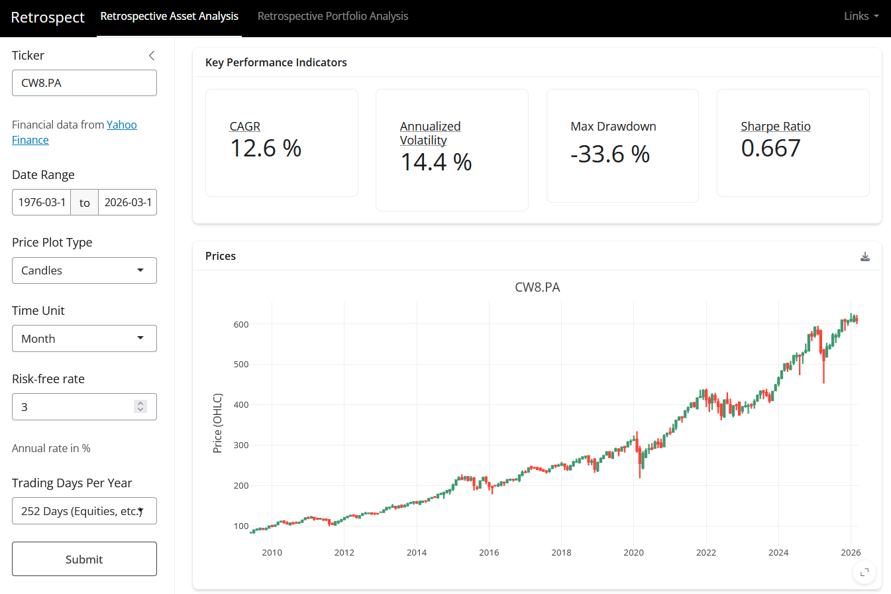
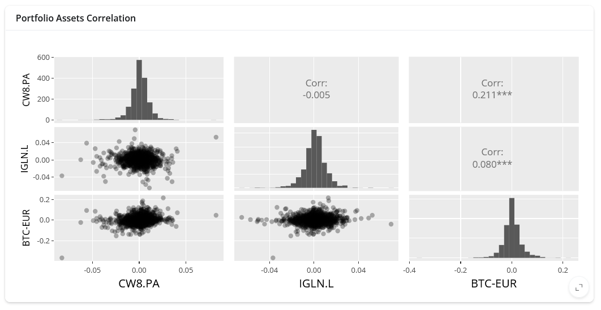
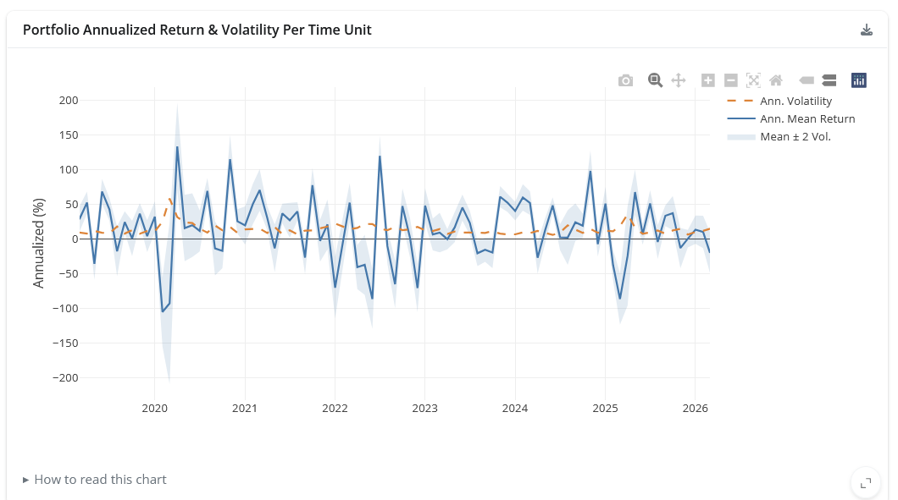
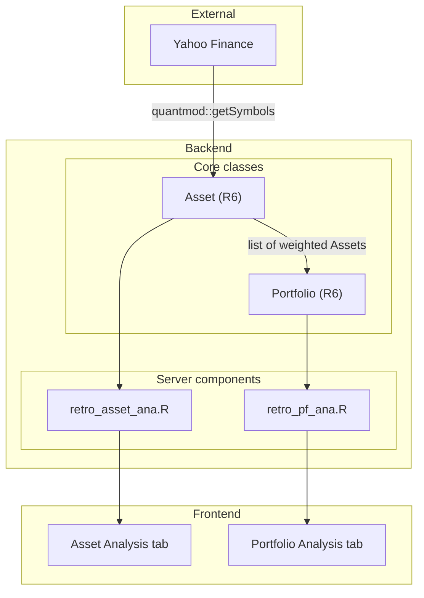

# :calendar: Retrospect
## Why

Many widely-available tools provide metrics about a ticker or a portfolio (e.g., [testfol.io](testfol.io), [finance.yahoo.com](finance.yahoo.com)), but I couldn't find one:
- with all the metrics I need,
- not too much complexity for a simple exploratory use case,
- and which is free.

So I built it myself.


## Features

### Retrospective Asset Analysis
- **KPIs**: CAGR, annualized volatility, max drawdown, Sharpe ratio
- **Classic price chart**
- **Return per time unit**
- **Drawdown chart**
- **Annualized return & volatility per time unit**: mean return vs. volatility with ±2σ band

### Retrospective Portfolio Analysis
- All asset-level KPIs and charts applied to the portfolio as a whole
- **Per-asset KPI table**: side-by-side comparison of all assets
- **Normalized performance chart**: portfolio vs. individual assets on a common baseline
- **Correlation SPLOM**: pairwise scatter plot matrix of asset returns

### Parameters (both tabs)
- Date range, time unit (day → year), risk-free rate, trading days/year (252 equities / 365 crypto)

### General
- CSV download on every time series chart
- Shareable URLs via query parameters
- Data from [Yahoo Finance](https://finance.yahoo.com)

### Screenshots








## Quick start

Launch the app from you terminal with the following commands:
```sh
git clone git@github.com:Konilo/retrospect.git
cd retrospect
docker compose build
docker compose up
```


## Architecture




## Development setup

- Install [Docker](https://www.docker.com/) and [VS Code](https://code.visualstudio.com/) (or a VS Code-based IDE).
- Open the directory in your IDE.
- Reopen the workspace in its dev container (F1 and search for "Reopen in container").


## Note

The bulk of the backend and frontend logic was coded by hand to practice clean R coding and R Shiny dashboarding. I then came back with Claude Code to iterate on those fundations.
